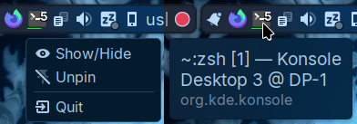

# KWin Minimize2Tray

**This is work in progress, don't expect feature parity with other implementations right away**

Hide windows to the system tray, similar to [KDocker](https://github.com/user-none/KDocker) but in the form of a KWin Script that works on Wayland.



## Installation

No KDE Store this time as the C++ plugin needs to be compiled manually

You will need to install any required dependencies

```sh
git clone https://github.com/luisbocanegra/kwin-minimize2tray.git
cd kwin-minimize2tray
./install.sh
```

### Immutable distributions

Use the `install-immutable.sh` then add `~/.local/lib/qml` to `QML_IMPORT_PATH` for the C++ plugin to work:

Create the file `~/.config/plasma-workspace/env/path.sh` (and folders if they don't exist) with the following:

```sh
export QML_IMPORT_PATH="$HOME/.local/lib/qml:$QML_IMPORT_PATH"
```

Log-out or reboot to apply the change

For more information see <https://userbase.kde.org/Session_Environment_Variables>

## Configuration/Usage

Enable/disable

1. *Minimize to tray* from *System Settings* > *Window Management* > *KWin Scripts*

By default the shortcut is set to `Alt+S`, to change it:

1. *System Settings* > *Keyboard* > *Shortcuts*
2. From the list on the left select *KWin*
3. Search for "Minimize window to tray" and change it to whatever you prefer

## Acknowledgements

[Unity LauncherAPI](https://wiki.ubuntu.com/Unity/LauncherAPI) implementation is a simplified version of [KDE/plasma-desktop/applets/taskmanager/plugin/smartlaunchers](https://github.com/KDE/plasma-desktop/tree/e3ba92b113d8a4e2d47a589835e9d867059dc2b9/applets/taskmanager/plugin/smartlaunchers)

## Support the development

If you like what I do consider donating/sponsoring this and [my other open source work](https://github.com/luisbocanegra?tab=repositories&q=&type=source&language=&sort=stargazers)

[](https://github.com/sponsors/luisbocanegra) [](https://ko-fi.com/luisbocanegra) [](https://www.buymeacoffee.com/luisbocanegra) [](https://liberapay.com/luisbocanegra/) [](https://www.paypal.com/donate/?hosted_button_id=Y5TMH3Z4YZRDA)
